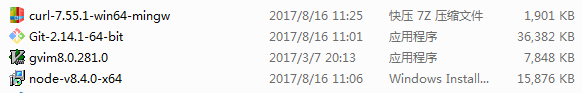
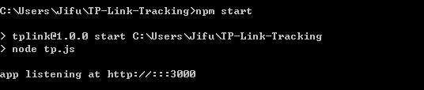
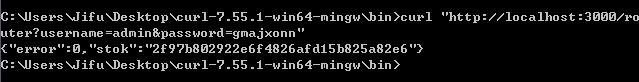
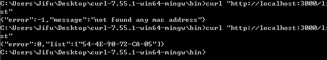
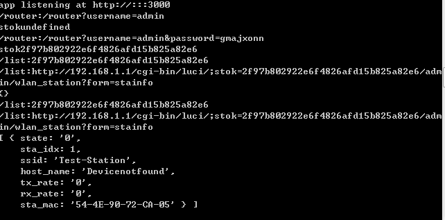

# Windows下面的安装

## 1. 下载相关的软件

> gvim 是编辑器可以不安装，其他git / node / curl都需要安装

## 2. 下载代码并运行

1.  `git clone https://github.com/TidleCao/TP-Link-Tracking.git`
2.  `cd TP-Link-Tracking `
3.  `npm install`
4.  `npm start`

##  查询 mac address的命令

1. `npm start`命令运行后的截图
  

2. 第一登录路由的命令：`http://localhost:3000/router?username=xxx&password=xxx`

3. 获取MAC address的命令： `http://localhost:3000/list`

## 调试、日志
每次运行命令查询mac address后终端会生成日志信息。方便以后定位问题。
